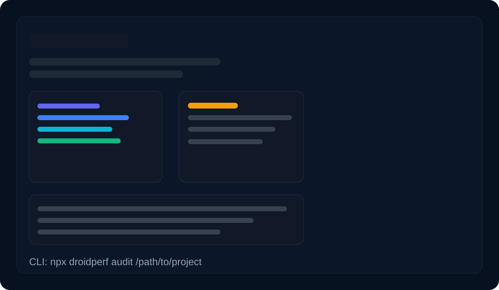
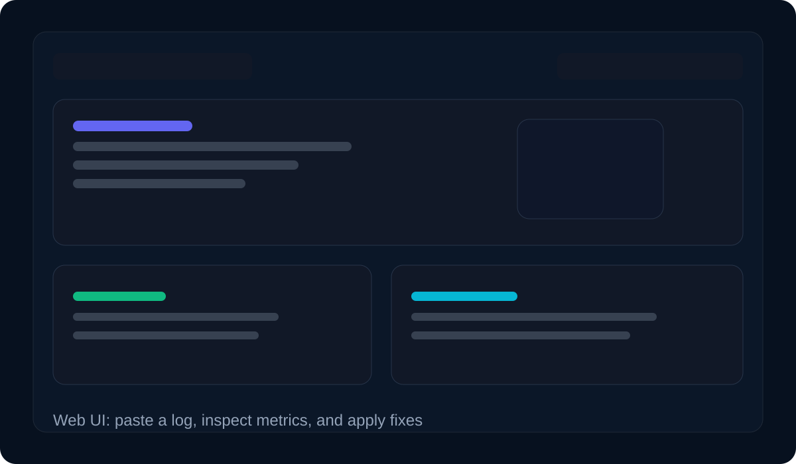

# droidperf

[](https://www.npmjs.com/package/droidperf)
[](https://github.com/rudradave1/droidperf/actions/workflows/ci.yml)
[](./LICENSE)

Android Gradle performance auditor and auto-fixer.

Audit and safely fix common Gradle build-time misconfigurations in Android projects.

## What's new in 2.1
## What's new in 2.2
- **Diagnostic Dashboard**: Complete UI overhaul with Health Score ring, severity-coded findings, and pro-grade dark mode.
- **Instant Log Upload**: Drag-and-drop support for Gradle build logs for immediate analysis.
- **API Stability**: New `/api/rules` endpoint and robust error handling with slide-down banners.
- **Local-First**: Zero-dependency frontend, works via `file://` or `localhost`.

## What's new in 2.0

- **AI-powered build analysis** via LLM (`npx droidperf analyze`)
- **Auto-apply fixes** with `--apply`
- **Dry-run preview** for AI fixes with `--dry-run`
- **Save report** to `droidperf-report.md` for team sharing

It's designed to be boring in the best way: conservative fixes, transparent diffs, and easy rollback.

## Design Philosophy

- Prefer safe, reversible fixes over aggressive optimizations
- Avoid modifying build scripts directly (only gradle.properties)
- Focus on high-impact, low-risk improvements first

## Demo

### 1. Audit your project

```bash
npx droidperf audit /path/to/your/android/project
```

### 2. Analyze a build log (offline — no API key needed)

```bash
npx droidperf analyze --build-log ./build.log --local
```

### 3. Analyze with an LLM

```bash
npx droidperf analyze --build-log ./build.log
```

### 4. Preview fixes before applying

```bash
npx droidperf fix /path/to/your/android/project --dry-run
```

### 5. Apply fixes automatically

```bash
npx droidperf fix /path/to/your/android/project
```

### 6. Open the interactive web dashboard

```bash
npx droidperf ui
```

## Quickstart

```bash
npx droidperf audit /path/to/your/android/project
npx droidperf fix /path/to/your/android/project --dry-run
npx droidperf fix /path/to/your/android/project
```

Flutter repo? Point at the repo root — `droidperf` will auto-detect and audit the `android/` Gradle subproject.

## Release & deployment highlights

Droidperf is now packaged for both local use and containerized deployment.

### Screenshots





### Release checklist

1. Update the version in [package.json](package.json).
2. Write release notes in [CHANGELOG.md](CHANGELOG.md).
3. Commit and push your changes.
4. Create a tag such as `v2.2.0`.
5. Push the tag to trigger the publish workflow.

## CI/CD Automation

Droidperf provides a GitHub Action to automatically audit your project on every Pull Request.

### Setup

Add this file to your project at `.github/workflows/droidperf.yml`:

```yaml
name: Droidperf
on: [pull_request]
jobs:
  audit:
    runs-on: ubuntu-latest
    steps:
      - uses: actions/checkout@v3
      - name: Droidperf Audit
        uses: rudradave1/droidperf@master
```

### Docker deployment

```bash
docker build -t droidperf:latest .
docker run --rm -p 9000:9000 droidperf:latest
```

The container serves the dashboard on port `9000` by default.

### CI and release automation

- Pull requests and pushes to `main`/`master` run the CI workflow.
- Tags matching `v*.*.*` trigger the release workflow to publish to npm and draft a GitHub release.
- The CI workflow also builds a Docker image as a smoke test.

## One-pager

If you want a short "why/what/how" you can share, see [`docs/ONE_PAGER.md`](./docs/ONE_PAGER.md).

## Example output

```text
Scanning your Android project...

Found 7 issues costing you ~3.0 minutes per build:

[CRITICAL] Configuration cache disabled — +45s per build
[CRITICAL] Build cache disabled — +32s per build
[HIGH]     Parallel execution disabled — +38s per build
[HIGH]     Kotlin incremental disabled — +28s per build
[MEDIUM]   JVM heap too low — 2048mb — recommend 4096mb
[MEDIUM]   Configure on demand disabled — +12s per build
[LOW]      Gradle daemon disabled — +8s per build

Estimated waste: 3.0 min/build × 20 builds/day = 61 min/day

Run 'droidperf fix' to apply all fixes automatically.
```

Preview changes safely first:

```bash
npx droidperf fix /path/to/your/android/project --dry-run
```

`--dry-run` prints a full-file unified diff for every changed file, so you can see exactly what would be written.

## What the community found

Real results shared by people running `droidperf`:

- **Rudra Dave (maintainer)**: **1.3 min/build saved** on a real project run.

Community-driven latest updates:

- Exact `--dry-run` output now shows full-file diffs of what will be written.
- Added support for `kotlin.incremental.useClasspathSnapshot=true`.

## What it checks

| Rule | Severity | Auto-fix |
|------|----------|----------|
| Configuration cache disabled | CRITICAL | ✅ |
| Build cache disabled | CRITICAL | ✅ |
| Parallel execution disabled | HIGH | ✅ |
| Kotlin incremental disabled | HIGH | ✅ |
| Kotlin classpath snapshot incremental disabled | HIGH | ✅ |
| KAPT used instead of KSP | HIGH | — (manual migration) |
| JVM heap too low | MEDIUM | ✅ |
| Configure on demand disabled | MEDIUM | ✅ |
| Debug build incorrectly optimized | MEDIUM | — |
| Gradle daemon disabled | LOW | ✅ |
| Dynamic dependency versions | LOW | — (audit-only) |
| Large module count | INFO | — |

Dynamic dependency version detection scans `build.gradle*` and `gradle/libs.versions.toml`.

## Usage

### Audit

```bash
npx droidperf audit /path/to/your/android/project
```

### Apply fixes

```bash
# Preview first (recommended)
npx droidperf fix /path/to/your/android/project --dry-run

# Apply
npx droidperf fix /path/to/your/android/project

# Apply only specific rules
npx droidperf fix /path/to/your/android/project --only configuration-cache,build-cache

# Skip specific rules
npx droidperf fix /path/to/your/android/project --exclude jvm-heap

# Skip post-fix Gradle verification (useful when local JDK doesn't match the project's wrapper)
npx droidperf fix /path/to/your/android/project --no-verify
```

### Analyze a build log

```bash
# Offline — no API key required
npx droidperf analyze --build-log ./build.log --local

# With LLM (set key once)
npx droidperf config --set-key your-openrouter-key
npx droidperf analyze --build-log ./build.log

# With LLM — also apply recommended fixes
npx droidperf analyze --build-log ./build.log --apply

# Use a specific model
npx droidperf analyze --model openai/gpt-4o

# Skip Gradle verification when applying
npx droidperf analyze --build-log ./build.log --apply --no-verify
```

> **Offline fallback**: if no API key is configured (or the LLM call fails), `analyze` automatically falls back to the built-in local expert knowledge base. Use `--local` to force this mode explicitly.

### Web Dashboard

```bash
# Launch on default port 9000
npx droidperf ui

# Launch on a custom port
npx droidperf ui --port 8080
```

The dashboard opens in your browser automatically and lets you:

- Paste or upload a Gradle build log for instant analysis
- Enable OpenRouter AI Mode with an optional API key
- View project health scores for a local Gradle project
- Apply fixes directly from the browser with one click

### List rules

```bash
npx droidperf audit --list-rules
```

### Config file (optional)

Add `.droidperfrc.json` (or `droidperf.config.json`) at the project root:

```json
{
  "buildsPerDay": 20,
  "recommend": { "jvmXmxMb": 4096 },
  "rules": {
    "enabled": {
      "configure-on-demand": false
    }
  }
}
```

You can also pass it explicitly:

```bash
npx droidperf audit /path/to/project --config /path/to/.droidperfrc.json
```

### Machine-readable output (CI)

```bash
npx droidperf audit /path/to/your/android/project --json
npx droidperf fix /path/to/your/android/project --dry-run --json
```

## Safety

Before writing, `droidperf fix` saves a timestamped backup to `.droidperf-backup/`.

Example restore:

```bash
cp .droidperf-backup/gradle.properties.<timestamp>.bak gradle.properties
```

After applying, `droidperf fix` runs `./gradlew help` (or `gradle help` if no local wrapper is found) to verify the build configuration is still valid. If verification fails, all changes are automatically reverted from backup. Use `--no-verify` to skip this step.

## What it changes

`droidperf fix` only applies safe edits to `gradle.properties`:

- `org.gradle.configuration-cache=true`
- `org.gradle.caching=true`
- `org.gradle.parallel=true`
- `kotlin.incremental=true`
- `kotlin.incremental.useClasspathSnapshot=true`
- `org.gradle.configureondemand=true`
- `org.gradle.daemon=true`
- `org.gradle.jvmargs`: updates/sets `-Xmx` (4096m) and ensures `-Dfile.encoding=UTF-8` **without deleting your existing JVM args flags**

Dynamic dependency versions are reported but not auto-fixed.

## Notes

- **Supported**: Android Gradle projects (Groovy + Kotlin DSL), KMP (Gradle-based), version catalogs, composite builds (`includeBuild(...)` best-effort), and Flutter's Android module (auto-detects `android/`).
- **Gradle wrapper**: `droidperf` automatically uses `./gradlew` if present, falling back to a globally installed `gradle` command.
- **Guardrails**: very large files are skipped to keep scans fast and predictable.

## Output formats

- `--no-color`: disable ANSI colors (CI-friendly)
- `--json`: machine-readable output for audits/fixes

## Changelog

See [`CHANGELOG.md`](./CHANGELOG.md).

## Contributing

See [`CONTRIBUTING.md`](./CONTRIBUTING.md).

## Security

See [`SECURITY.md`](./SECURITY.md).

## Roadmap

See the [upcoming features](https://github.com/rudradave1/droidperf/issues):
- **Local LLM Support**: Integration with Ollama for fully offline analysis.
- **Visual Timelines**: Mermaid.js charts generated from build logs.
- **Project Structure Analysis**: Deep scan of `build.gradle` files to suggest modularization.

## Maintainer

Maintained by **Rudra Dave**.

Built by a senior Android/KMP engineer.
Open to remote roles → [github.com/rudradave1](https://github.com/rudradave1)

- **Issues**: use GitHub Issues for bugs/features
- **Security**: see [`SECURITY.md`](./SECURITY.md)
- **Contact**: `rudramordan@gmail.com`
- **Updates**: `https://www.linkedin.com/in/rudradave/`

## Local development

```bash
npm install
node bin/droidperf.js audit --path /path/to/android/project --no-color
node bin/droidperf.js fix --path /path/to/android/project --dry-run --no-color
node bin/droidperf.js analyze --build-log ./build.log --local
node bin/droidperf.js ui
```
